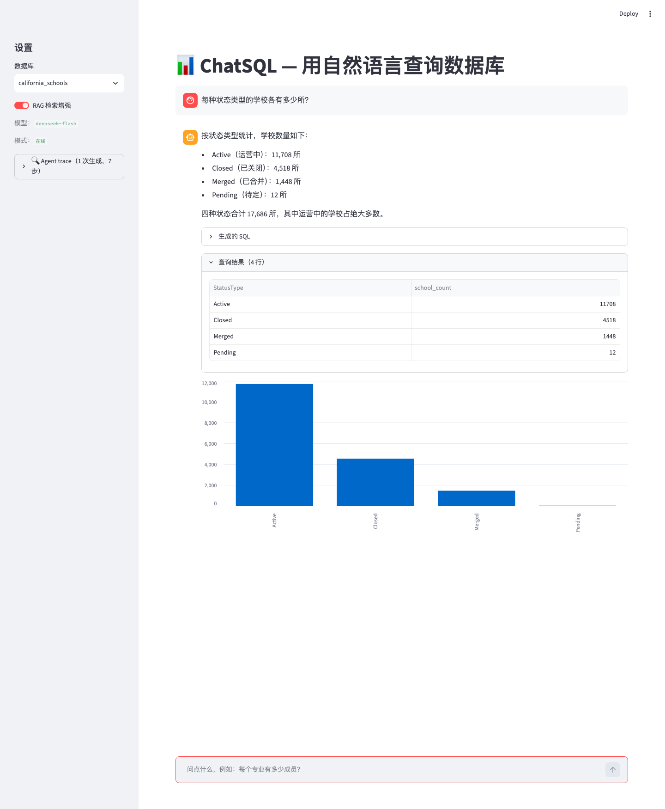
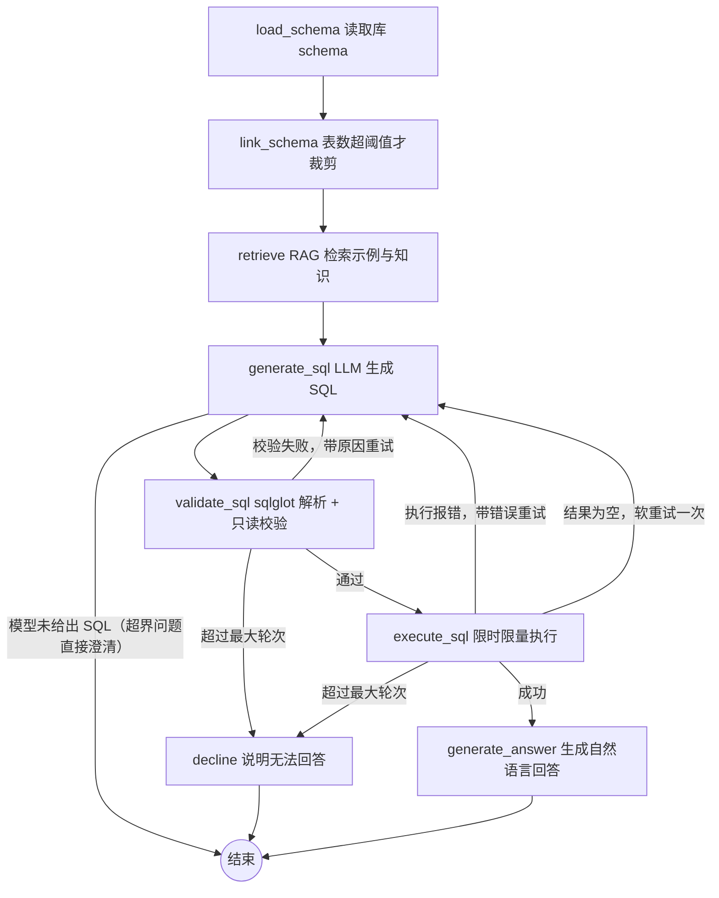

# ChatSQL

Agentic Text-to-SQL：用自然语言查询 SQLite 数据库（中英文提问均可）。

BIRD mini_dev 基准（500 题）执行准确率 **54.1%**，高出 BIRD 论文官方 GPT-4 baseline（47.8%）6.3 个百分点；56 个测试；每次问答全链路 trace 落盘。



## 亮点

- **Agent 闭环，而非单次生成**：LangGraph 状态机，SQL 生成 → sqlglot 只读校验 → SQLite 限时限量执行 → 失败带错误信息自纠错（最多 3 轮）→ 自然语言回答；超界问题走澄清路径，不会硬编 SQL
- **RAG 检索增强**：索引三类文档（相似问答对 / 专家知识 / 列描述），本地 all-MiniLM-L6-v2 embedding + numpy 自实现向量库（单库数百文档，暴力检索毫秒级）；评测按 question_id 留一排除防数据泄漏——RAG 带来 +10.9pp
- **实验驱动**：500 题 × 3 配置全量消融；一次完整的"假设 → 对照实验 → 证伪 → 逐题归因"阴性结果记录（见评测章节）
- **双界面**：CLI（单问 / 多轮对话 / trace 调试）+ Streamlit Web（对话式问答、结果自动出图、侧边栏 agent trace）
- **工程可复现**：任意 OpenAI 兼容端点（DeepSeek / Qwen / Ollama）、评测断点续跑与限流退避、无 API key 自动进入离线 mock 演示模式

## 架构



模块划分：

- `src/chatsql/agent/` — 状态机节点与路由、prompt、trace 落盘（`runs/*.jsonl`）
- `src/chatsql/rag/` — 索引构建与检索（embedding 抽象 / numpy 向量库）
- `src/chatsql/db/` — schema 抽取、只读执行器（默认 30s 超时、100 行上限）
- `src/chatsql/llm/` — OpenAI 兼容客户端 + 离线 mock
- `src/chatsql/eval/` — 评测 runner（并发 / 断点续跑 / 429 退避）、EX 指标、对比报告生成

## 快速开始

环境：Python 3.13+ 与 [uv](https://docs.astral.sh/uv/)。

```bash
uv sync
uv run python scripts/download_data.py   # 下载 BIRD mini_dev（约 800MB，国内走阿里云 OSS 直链）
cp .env.example .env                     # 不填 key 即为离线 mock 演示模式；填入 OpenAI 兼容 key 即可真实问答
uv run python scripts/build_index.py     # 构建 RAG 索引（首次会下载约 90MB embedding 模型）
```

```bash
# 单问（Agent 闭环：生成 → 校验 → 执行 → 自纠错 → 回答）
uv run python cli.py --db california_schools "How many schools have free meal rate above 50%?"

# 多轮对话（支持追问）
uv run python cli.py --db student_club --chat

# 调试：打印每步 trace；--mode direct 使用无纠错的单发 baseline
uv run python cli.py --db student_club --verbose "What's Angela Sanders's major?"

# Web 界面（推荐演示用）：选库、Schema 面板、对话、SQL/结果表/自动图表、侧边栏 trace
uv run streamlit run app.py
```

不建索引也能跑：retrieve 节点会跳过并在 trace 注明，只是没有 RAG 增益。

## 配置

所有参数集中在 `configs/settings.yaml`，支持 `${VAR:-default}` 环境变量展开（shell 或 `.env` 注入）：

| 配置 | 默认 | 说明 |
|---|---|---|
| `model.name` / `base_url` / `api_key` | deepseek-flash / api.deepseek.com / 空 | 任意 OpenAI 兼容端点；key 为空自动进入 mock 模式 |
| `database.root` | `data/mini_dev_data/dev_databases` | 可用 `CHATSQL_DB_ROOT` 指向自己的库目录 |
| `agent.max_correction_rounds` | 3 | 生成-执行最大自纠错轮次 |
| `agent.retry_on_empty` | true | 空结果软重试开关（消融实验产物，见评测章节） |
| `agent.linking_table_threshold` | 20 | 表数超过该值才启用 schema linking 裁剪 |
| `rag.enabled` / `top_k_examples` / `top_k_knowledge` | 开 / 3 / 3 | 检索开关与条数；`CHATSQL_RAG=0` 或 `--no-rag` 关闭 |
| `execution.timeout_seconds` / `max_rows` | 30 / 100 | 只读执行的保护限制 |

## 用自己的数据

agent 直接读 SQLite 文件里的 schema，不依赖 BIRD 数据：

```bash
# 1. 按约定放库：<root>/<库名>/<库名>.sqlite
mkdir -p ~/mydata/sales && cp sales.sqlite ~/mydata/sales/

# 2. 指向你的库目录（写进 .env 或 export）
echo 'CHATSQL_DB_ROOT=/Users/tengxiao/mydata' >> .env

# 3. 正常使用，Web 界面侧边栏也会自动列出
uv run python cli.py --db sales "上个月各产品的销售额是多少？"
```

注意：`.env` 里要填真实 API key（mock 模式只返回预置 SQL）；目前仅支持 SQLite，表数超 20 自动启用 schema linking。

自己的数据同样能吃 RAG 增益，两类文档都是可选的：

- **列描述**（业务知识，帮助最大）：在 `<库名>/database_description/<表名>.csv` 里按 BIRD 格式写列说明，列头为 `original_column_name,column_name,column_description,data_format,value_description`，例如解释"amt 单位是万元、已扣退款"——这些描述同时也会展示在 Web 界面的 Schema 面板里
- **问答对**（few-shot 示例）：按 BIRD 格式写自己的 JSON（`question_id/db_id/question/SQL/evidence`），然后 `uv run python scripts/build_index.py --data-json 你的文件.json`

没有问答对文件时 `build_index.py` 会自动降级为只索引列描述。

## 项目结构

```
├── app.py                  # Streamlit Web 界面
├── cli.py                  # 命令行入口（单问 / 多轮 / trace）
├── configs/settings.yaml   # 全部可调参数
├── src/chatsql/            # agent / rag / db / llm / eval / viz
├── scripts/                # 数据下载、索引构建、评测、报告生成
├── tests/                  # 56 个测试（uv run pytest）
└── eval/reports/           # 评测对比报告（含逐题明细）
```

## 评测（BIRD mini_dev，500 题，Execution Accuracy）

模型：`deepseek-flash`（temperature=0），2026-09-14。RAG 评测按 question_id 留一排除防泄漏。

| 配置 | EX | 较基线 |
|---|---|---|
| baseline（单发直出） | 43.2% | - |
| + 自纠错（3 轮） | 43.7% | +0.5pp |
| + 自纠错 + RAG | **54.1%** | **+10.9pp** |

参考：BIRD 官方 baseline 中 GPT-4 为 47.8%。

**消融分析**（完整报告见 `eval/reports/`）：

- **RAG 是主要提升来源**：challenging 难度 +13.8pp（20.8% → 34.6%），11 个库中 8 个提升
- **自纠错消除了全部执行错误**（124 → 0），但对语义错误无能为力——BIRD 的失败以语义错误为主

**阴性结果（一次被证伪的假设）**：消融中发现 european_football_2 回退 13.7pp，最初怀疑是"空结果软重试"过度修正。做了对照实验（关闭软重试重跑该库 51 题）：EX 37.3%，未回升——假设证伪。逐题归因发现 11 题回退中 9 题首次生成就已分叉（attempts=1），真正原因是 baseline 与 agent 的 prompt 措辞差异导致的**生成方差**，而非纠错机制。软重试保留为可配置开关（`--no-empty-retry`），runner 支持 `--db`/`--difficulty` 子集实验。

复现：

```bash
uv run python scripts/run_eval.py --config direct --tag full_direct
uv run python scripts/run_eval.py --config agent --tag full_agent
uv run python scripts/run_eval.py --config agent_rag --tag full_agent_rag
uv run python scripts/make_report.py full_direct full_agent full_agent_rag
```

## 难点与解决

1. **embedding 模型并发调用死锁**：评测 runner 多线程并发时，sentence-transformers 的模型加载与推理偶发死锁。解法：embedder 内用锁把加载和 encode 串行化（`rag/embedder.py`）——embedding 不是吞吐瓶颈，影响可忽略。

2. **sqlglot 宽松解析把中文句子当合法 SQL**：模型对超界问题直接输出中文解释时，sqlglot 会把整句话解析成一个标识符（Column 节点），"语法校验"居然通过，随后执行报错、空转 3 轮才降级。解法：校验不满足于"能 parse"，要求语法树中存在 Select/Union 等查询节点（`agent/nodes.py` 的 `_looks_like_sql()`）；模型未产出 SQL 时直接走澄清路径。

3. **BIRD 数据包结构与冗余**：官方 zip 解压是 `minidev/MINIDEV` 嵌套目录，还捆绑 MySQL/PostgreSQL 两份共约 2GB 无关数据。解法：下载脚本自动归一化目录、裁剪冗余，并校验完整性（11 库 + 500 题），失败时给出手动下载指引（`scripts/download_data.py`）。

4. **transformers × Streamlit 的隐蔽冲突**：transformers 5.x 的 zoedepth 图像处理器在模块顶层无守卫地 `import torchvision`（其他视觉模型文件都有守卫）；Streamlit 的文件监听器遍历 `sys.modules` 访问属性时触发该模块懒加载，Web 界面报 `ModuleNotFoundError: No module named 'torchvision'`，而 CLI 完全正常。解法：显式声明 torchvision 依赖。

5. **.gitignore 目录排除陷阱**：`eval/reports/` 整目录排除后，`!eval/reports/compare_*.md` 反选不生效（git 不会进入被排除的目录）。解法：改为 `eval/reports/*` + `!eval/reports/compare_*.md`。

## 局限与方向

- 剩余失败以**语义错误**为主（表列选对但条件/聚合逻辑偏差），自纠错对执行错误有效、对语义错误无解——下一步是生成端增强（更精细的 schema linking、ExCoT 式推理链）
- 只评了 EX（结果正确性），未评 VES（SQL 执行效率）；真实业务场景还需慢查询治理
- 索引为离线静态构建，未做增量更新；多轮对话的指代消解目前依赖 prompt，未做专门的对话状态管理

## 数据来源

[BIRD Mini-Dev](https://github.com/bird-bench/mini_dev)：500 条高质量 text-to-SQL 问答对，覆盖 11 个 SQLite 数据库。
BIRD 论文：*Can LLM Already Serve as A Database Interface? A Comprehensive Evaluation for Large-Scale Database-Grounded Text-to-SQLs*（NeurIPS 2023），数据遵循 CC BY-SA 4.0。

## License

代码 MIT（见 `LICENSE`）；数据集遵循其原始许可。
